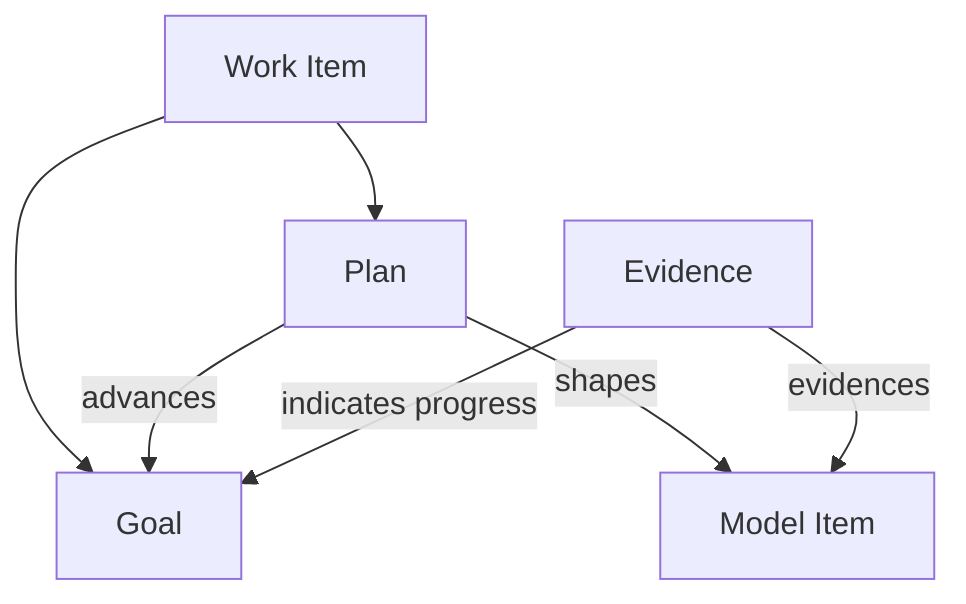

A [[spec-workstream-atlas.atlas-model.goal|Goal]] is a strategic [[spec-workstream-atlas.atlas-model.work-item|Work Item]] that describes a desired future state without prescribing one fixed intervention for reaching it.

Goals and [[spec-workstream-atlas.atlas-model.plan|Plans]] are siblings, not larger and smaller versions of the same thing:

1. a Goal says what outcome would count as progress or success,
2. a Plan defines a bounded intervention that can advance one or more Goals,
3. Model Items describe the durable system forms that Plans shape while advancing those Goals,
4. Evidence shows whether the intended forms and outcomes actually materialized.

## Goal Relationships

The minimum useful model should support:

1. `Plan advances Goal`,
2. `Goal supports/refines Goal` when strategic outcomes need decomposition,
3. `Plan shapes Model Item`,
4. `Evidence evidences Model Item` and may indicate progress toward a Goal.

A Plan may have one primary Goal for navigation while advancing other Goals secondarily. Goal decomposition should not be forced into a strict tree before real planning pressure requires it.

## Workstream Position

Workstream is not a first-class Work Item in the v0 model.

For now, a workstream is a planning projection: a view that groups Plans by Goal, territory, model area, ongoing concern, or some combination of them. It answers "which continuing line of activity does this work belong to?" rather than "what outcome do we want?" or "what bounded intervention will we execute?"

Promote Workstream to a declared item only if it later needs stable identity, ownership, status, policy, or decisions independent from the Goals and Plans it groups.

## Open Questions

1. Should Goal eventually become its own Atlas item kind instead of using `kind: concept`?
2. Which relation best expresses goal decomposition: `supports`, `refines`, `part-of`, or a primary parent plus secondary relations?
3. How should goal progress be expressed without turning Atlas into a metrics system prematurely?
4. When should a derived workstream become a declared planning object?

## Evolution

This page documents the semantic direction only. Parser support, Goal-specific UI, authoring operations, hierarchy behavior, and progress projections belong to a later Atlas implementation slice.
